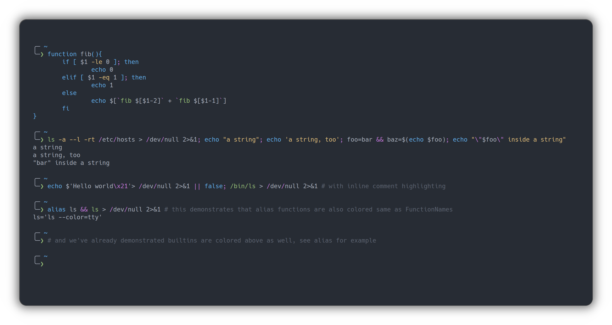

# One Dark for [zsh-syntax-highlighting](https://github.com/zsh-users/zsh-syntax-highlighting)

> A dark theme for [zsh-syntax-highlighting](https://github.com/zsh-users/zsh-syntax-highlighting).

This is a fork of a theme originally for Dracula. I've just made some minor adjustments and replaced the colors with the ones from [One Dark](https://github.com/joshdick/onedark.vim).

## Install

All instructions can be found at [draculatheme.com/zsh-syntax-highlighting](https://draculatheme.com/zsh-syntax-highlighting).

## License

[MIT License](./LICENSE)
